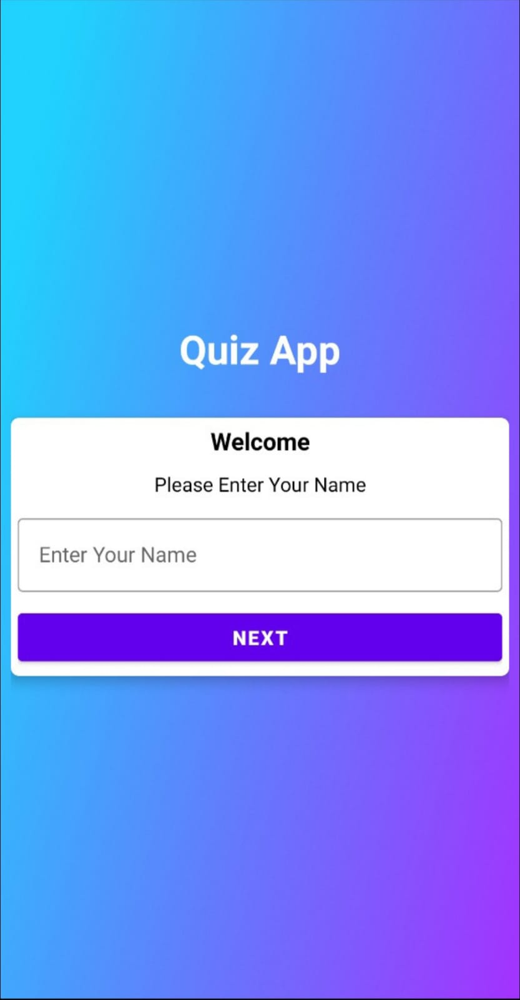
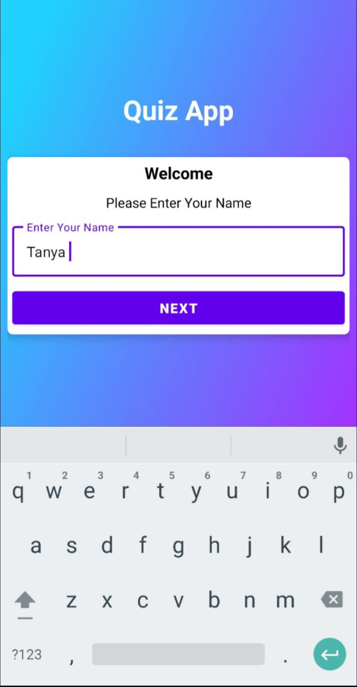
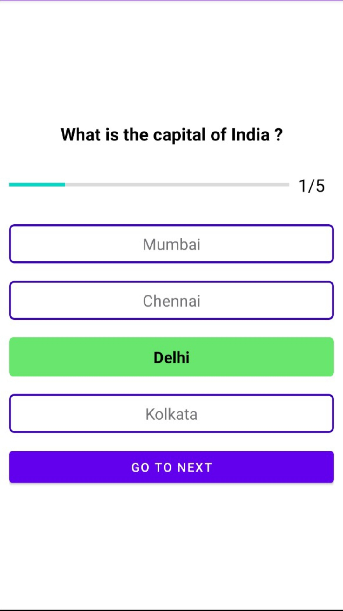
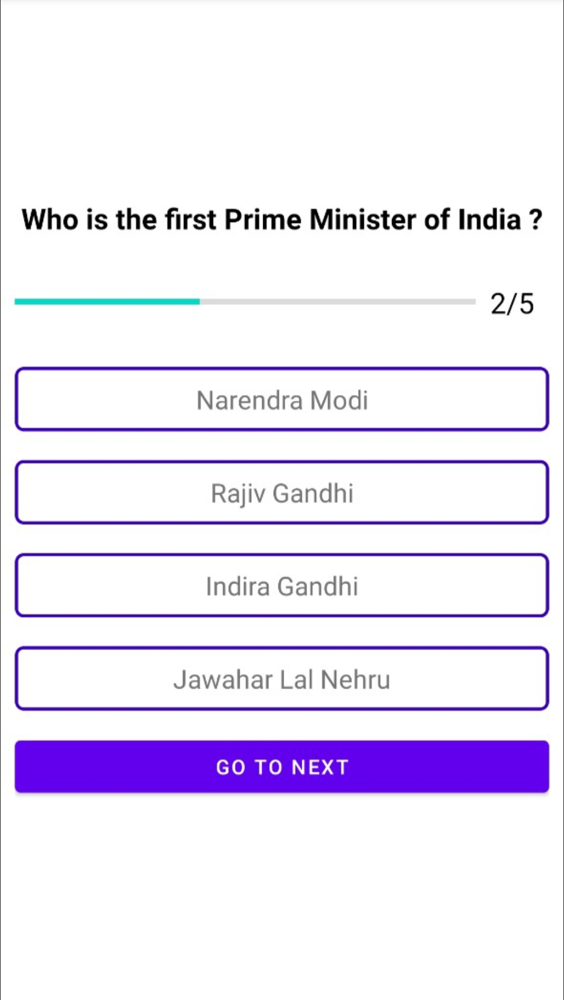
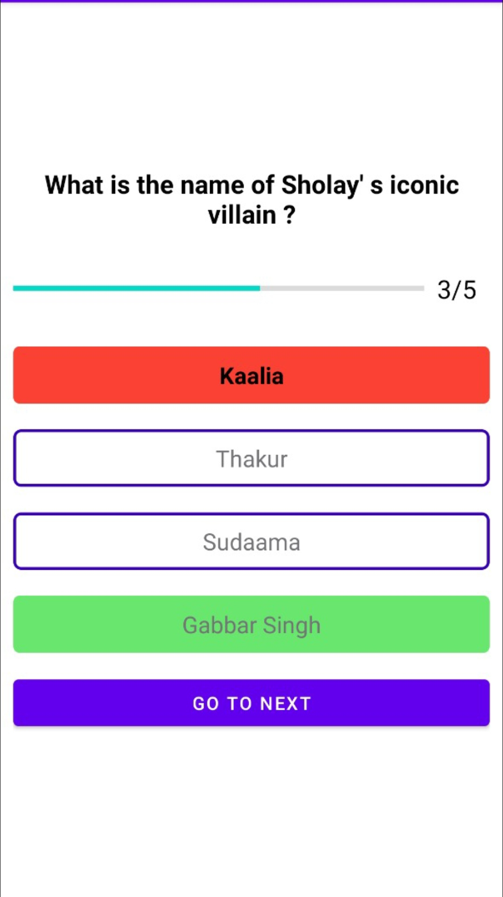

# Quiz-App

## 🌟 About
A simple Quiz Application made in **Kotlin**. It enables the user to undertake a series of questions. The app is user friendly and the user shall find it extremely easy to answer the multiple-choice questions. At the end of the quiz, a result-report is generated which states congratulations message with user's name and score.

## ✨ Screenshots

<div style="display:flex;">



</div>
<br>
<div style="display:flex;">



</div>

## 🌟 Prerequisites
*   Android Studio 
*   Java JDK

## 🔨 Build and Run Application

Follow this steps to get Working Project!
```
1. Clone this repository or download file
2. Extract zip if downloaded code
3. Open project in Android Studio
4. Wait while Android Studio Download gradle or required files
5. Hit Run Button !
```
